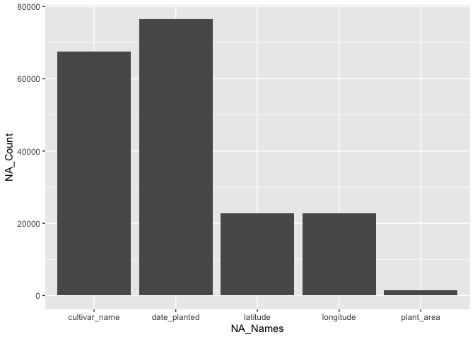
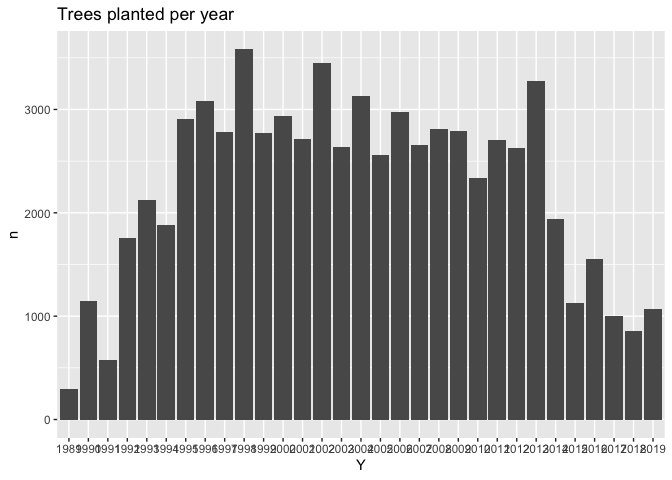
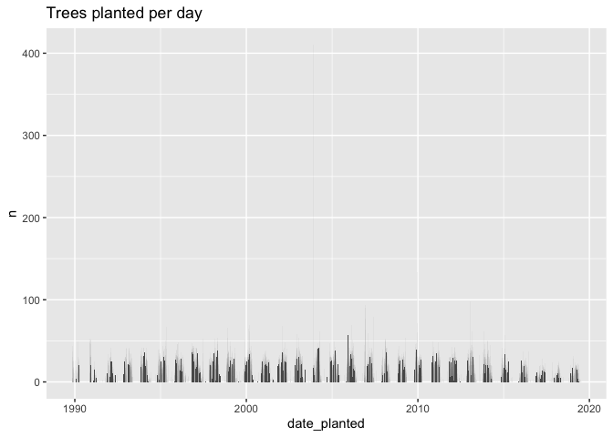

Mini Data-Analysis Deliverable 1
================

# Welcome to your (maybe) first-ever data analysis project!

And hopefully the first of many. Let’s get started:

1.  Install the [`datateachr`](https://github.com/UBC-MDS/datateachr)
    package by typing the following into your **R terminal**:

<!-- -->

``` r
devtools::install_github("UBC-MDS/datateachr")
```

    ## Skipping install of 'datateachr' from a github remote, the SHA1 (78d391f4) has not changed since last install.
    ##   Use `force = TRUE` to force installation

2.  Load the packages below.

``` r
library(datateachr)
library(tidyverse)
```

    ## Warning: package 'tidyverse' was built under R version 4.1.2

    ## ── Attaching packages ─────────────────────────────────────── tidyverse 1.3.2 ──
    ## ✔ ggplot2 3.3.5      ✔ purrr   0.3.4 
    ## ✔ tibble  3.1.8      ✔ dplyr   1.0.10
    ## ✔ tidyr   1.1.4      ✔ stringr 1.4.0 
    ## ✔ readr   2.1.3      ✔ forcats 0.5.1

    ## Warning: package 'tibble' was built under R version 4.1.2

    ## Warning: package 'readr' was built under R version 4.1.2

    ## Warning: package 'dplyr' was built under R version 4.1.2

    ## ── Conflicts ────────────────────────────────────────── tidyverse_conflicts() ──
    ## ✖ dplyr::filter() masks stats::filter()
    ## ✖ dplyr::lag()    masks stats::lag()

3.  Make a repository in the <https://github.com/stat545ubc-2022>
    Organization. You will be working with this repository for the
    entire data analysis project. You can either make it public, or make
    it private and add the TA’s and Lucy as collaborators. A link to
    help you create a private repository is available on the
    \#collaborative-project Slack channel.

# Instructions

## For Both Milestones

-   Each milestone is worth 45 points. The number of points allocated to
    each task will be annotated within each deliverable. Tasks that are
    more challenging will often be allocated more points.

-   10 points will be allocated to the reproducibility, cleanliness, and
    coherence of the overall analysis. While the two milestones will be
    submitted as independent deliverables, the analysis itself is a
    continuum - think of it as two chapters to a story. Each chapter, or
    in this case, portion of your analysis, should be easily followed
    through by someone unfamiliar with the content.
    [Here](https://swcarpentry.github.io/r-novice-inflammation/06-best-practices-R/)
    is a good resource for what constitutes “good code”. Learning good
    coding practices early in your career will save you hassle later on!

## For Milestone 1

**To complete this milestone**, edit [this very `.Rmd`
file](https://raw.githubusercontent.com/UBC-STAT/stat545.stat.ubc.ca/master/content/mini-project/mini-project-1.Rmd)
directly. Fill in the sections that are tagged with
`<!--- start your work below --->`.

**To submit this milestone**, make sure to knit this `.Rmd` file to an
`.md` file by changing the YAML output settings from
`output: html_document` to `output: github_document`. Commit and push
all of your work to the mini-analysis GitHub repository you made
earlier, and tag a release on GitHub. Then, submit a link to your tagged
release on canvas.

**Points**: This milestone is worth 45 points: 43 for your analysis, 1
point for having your Milestone 1 document knit error-free, and 1 point
for tagging your release on Github.

# Learning Objectives

By the end of this milestone, you should:

-   Become familiar with your dataset of choosing
-   Select 4 questions that you would like to answer with your data
-   Generate a reproducible and clear report using R Markdown
-   Become familiar with manipulating and summarizing your data in
    tibbles using `dplyr`, with a research question in mind.

# Task 1: Choose your favorite dataset (10 points)

The `datateachr` package by Hayley Boyce and Jordan Bourak currently
composed of 7 semi-tidy datasets for educational purposes. Here is a
brief description of each dataset:

-   *apt\_buildings*: Acquired courtesy of The City of Toronto’s Open
    Data Portal. It currently has 3455 rows and 37 columns.

-   *building\_permits*: Acquired courtesy of The City of Vancouver’s
    Open Data Portal. It currently has 20680 rows and 14 columns.

-   *cancer\_sample*: Acquired courtesy of UCI Machine Learning
    Repository. It currently has 569 rows and 32 columns.

-   *flow\_sample*: Acquired courtesy of The Government of Canada’s
    Historical Hydrometric Database. It currently has 218 rows and 7
    columns.

-   *parking\_meters*: Acquired courtesy of The City of Vancouver’s Open
    Data Portal. It currently has 10032 rows and 22 columns.

-   *steam\_games*: Acquired courtesy of Kaggle. It currently has 40833
    rows and 21 columns.

-   *vancouver\_trees*: Acquired courtesy of The City of Vancouver’s
    Open Data Portal. It currently has 146611 rows and 20 columns.

**Things to keep in mind**

-   We hope that this project will serve as practice for carrying our
    your own *independent* data analysis. Remember to comment your code,
    be explicit about what you are doing, and write notes in this
    markdown document when you feel that context is required. As you
    advance in the project, prompts and hints to do this will be
    diminished - it’ll be up to you!

-   Before choosing a dataset, you should always keep in mind **your
    goal**, or in other ways, *what you wish to achieve with this data*.
    This mini data-analysis project focuses on *data wrangling*,
    *tidying*, and *visualization*. In short, it’s a way for you to get
    your feet wet with exploring data on your own.

And that is exactly the first thing that you will do!

1.1 Out of the 7 datasets available in the `datateachr` package, choose
**4** that appeal to you based on their description. Write your choices
below:

**Note**: We encourage you to use the ones in the `datateachr` package,
but if you have a dataset that you’d really like to use, you can include
it here. But, please check with a member of the teaching team to see
whether the dataset is of appropriate complexity. Also, include a
**brief** description of the dataset here to help the teaching team
understand your data.

<!-------------------------- Start your work below ---------------------------->

**1:** vancouver\_trees  
**2:** apt\_buildings  
**3:** steam\_games  
**4:** building\_permits

<!----------------------------------------------------------------------------->

1.2 One way to narrowing down your selection is to *explore* the
datasets. Use your knowledge of dplyr to find out at least *3*
attributes about each of these datasets (an attribute is something such
as number of rows, variables, class type…). The goal here is to have an
idea of *what the data looks like*.

*Hint:* This is one of those times when you should think about the
cleanliness of your analysis. I added a single code chunk for you below,
but do you want to use more than one? Would you like to write more
comments outside of the code chunk?

<!-------------------------- Start your work below ---------------------------->

**vancouver\_trees Exploration**

``` r
##dim() to find the number of rows and columns
dim(vancouver_trees)
##Reveals 146611 rows and 20 columns/variables

##str() to find the type of each variable
str(vancouver_trees)
##Reveals 7 numeric variables, 12 character variables, 1 date variable
##Also gives a sample from each variable

##Search for NA values in data
colSums(is.na(vancouver_trees))
##NA values in 5 variables
```

  
**apt\_buildings Exploration**

``` r
##dim() to find the number of rows and columns
dim(apt_buildings)
##Reveals 3455 rows and 37 columns/variables

##str() to find the type of each variable
str(apt_buildings)
##Reveals 9 numeric variables, 28 character variables
##Also gives a sample from each variable

##Search for NA values in data
colSums(is.na(apt_buildings))
##Only 9 variables don't have NA's
```

  
**steam\_games Exploration**

``` r
##dim() to find the number of rows and columns
dim(steam_games)
##Reveals 40833 rows and 21 columns/variables

##str() to find the type of each variable
str(steam_games)
##Reveals 4 numeric variables, 17 character variables
##Also gives a sample from each variable

##Search for NA values in data
colSums(is.na(steam_games))
##Only 2 variables don't have NA's
```

  
**building\_permits Exploration**

``` r
##dim() to find the number of rows and columns
dim(building_permits)
##Reveals 20680 rows and 14 columns/variables

##str() to find the type of each variable
str(building_permits)
##Reveals 3 numeric variables, 10 character variables, 1 date variable
##Also gives a sample from each variable

##Search for NA values in data
colSums(is.na(building_permits))
##Only 6 variables don't have NA's
```

<!----------------------------------------------------------------------------->

1.3 Now that you’ve explored the 4 datasets that you were initially most
interested in, let’s narrow it down to 2. What lead you to choose these
2? Briefly explain your choices below, and feel free to include any code
in your explanation.

<!-------------------------- Start your work below ---------------------------->

1: **vancouver\_trees** - Lots of interesting variables including
latitude and longitude, diameter, genus name, species name, etc. Overall
seems like there are many analyses that I could perform with this
data.  
2: **steam\_games** - Information is interesting, and easy to interpret.
Many possible regression analyses using review or price as response
variable.
<!----------------------------------------------------------------------------->

1.4 Time for the final decision! Going back to the beginning, it’s
important to have an *end goal* in mind. For example, if I had chosen
the `titanic` dataset for my project, I might’ve wanted to explore the
relationship between survival and other variables. Try to think of 1
research question that you would want to answer with each dataset. Note
them down below, and make your final choice based on what seems more
interesting to you!

<!-------------------------- Start your work below ---------------------------->

1: **vancouver\_trees** - Would like to explore how the diameter of a
tree is influenced by species type, location, date planted, etc.
(CHOOSING THIS ONE)  
2: **steam\_games** - Would like to explore how review is influenced by
developer, price, etc.
<!----------------------------------------------------------------------------->

# Important note

Read Tasks 2 and 3 *fully* before starting to complete either of them.
Probably also a good point to grab a coffee to get ready for the fun
part!

This project is semi-guided, but meant to be *independent*. For this
reason, you will complete tasks 2 and 3 below (under the **START HERE**
mark) as if you were writing your own exploratory data analysis report,
and this guidance never existed! Feel free to add a brief introduction
section to your project, format the document with markdown syntax as you
deem appropriate, and structure the analysis as you deem appropriate.
Remember, marks will be awarded for completion of the 4 tasks, but 10
points of the whole project are allocated to a reproducible and clean
analysis. If you feel lost, you can find a sample data analysis
[here](https://www.kaggle.com/headsortails/tidy-titarnic) to have a
better idea. However, bear in mind that it is **just an example** and
you will not be required to have that level of complexity in your
project.

# Task 2: Exploring your dataset (15 points)

If we rewind and go back to the learning objectives, you’ll see that by
the end of this deliverable, you should have formulated *4* research
questions about your data that you may want to answer during your
project. However, it may be handy to do some more exploration on your
dataset of choice before creating these questions - by looking at the
data, you may get more ideas. **Before you start this task, read all
instructions carefully until you reach START HERE under Task 3**.

2.1 Complete *4 out of the following 8 exercises* to dive deeper into
your data. All datasets are different and therefore, not all of these
tasks may make sense for your data - which is why you should only answer
*4*. Use *dplyr* and *ggplot*.

1.  Plot the distribution of a numeric variable.
2.  Create a new variable based on other variables in your data (only if
    it makes sense)
3.  Investigate how many missing values there are per variable. Can you
    find a way to plot this?
4.  Explore the relationship between 2 variables in a plot.
5.  Filter observations in your data according to your own criteria.
    Think of what you’d like to explore - again, if this was the
    `titanic` dataset, I may want to narrow my search down to passengers
    born in a particular year…
6.  Use a boxplot to look at the frequency of different observations
    within a single variable. You can do this for more than one variable
    if you wish!
7.  Make a new tibble with a subset of your data, with variables and
    observations that you are interested in exploring.
8.  Use a density plot to explore any of your variables (that are
    suitable for this type of plot).

2.2 For each of the 4 exercises that you complete, provide a *brief
explanation* of why you chose that exercise in relation to your data (in
other words, why does it make sense to do that?), and sufficient
comments for a reader to understand your reasoning and code.

<!-------------------------- Start your work below ---------------------------->

# 2.1

  
**1. Plot the distribution of a numeric variable (diameter).**

``` r
#Data was hard to visulize as a boxplot due to outliers
#Latitude was used as a variable to spread out data
ggplot(vancouver_trees, aes(x = diameter, y = latitude)) +
  geom_jitter()
```

    ## Warning: Removed 22771 rows containing missing values (geom_point).

<!-- -->  
**3. Investigate how many missing values there are per variable. Can you
find a way to plot this?**

``` r
##Search for NA values in data
NAs <- colSums(is.na(vancouver_trees))
##NA values in 5 variables

##We plot it below
NA_Count_init <- as.numeric(NAs)
NA_Names_init <- colnames(is.na(vancouver_trees))

##Find indices of vector which are nonzero
nonzero <- which(NA_Count_init != 0)
NA_Count <- NA_Count_init[nonzero]
NA_Names <- NA_Names_init[nonzero]

##Plot nonzero indices
ggplot(data.frame(NA_Count = NA_Count,
                  NA_Names = NA_Names),
       aes(x = NA_Names, y = NA_Count)) +
  geom_col()
```

<!-- -->  
**2. Create a new variable based on other variables in your data**

``` r
##Seperate data by region
West_Region <- c("ARBUTUS-RIDGE", "DUNBAR-SOUTHLANDS", "KITSILANO", "WEST POINT GREY", "KERRISDALE")
Downtown_Region <- c("WEST END", "STRATHCONA", "DOWNTOWN")
East_Region <- c("VICTORIA-FRASERVIEW", "RENFREW-COLLINGWOOD", "KILLARNEY", "KENSINGTON-CEDAR COTTAGE", "HASTINGS-SUNRISE", "GRANDVIEW-WOODLAND")
Central_Region <- c("SUNSET", "SOUTH CAMBIE", "SHAUGHNESSY", "RILEY PARK", "OAKRIDGE", "MOUNT PLEASANT", "MARPOLE", "FAIRVIEW")

##Add new region variable
vancouver_trees_r <- vancouver_trees %>%
  mutate(Region = case_when(
    neighbourhood_name %in% West_Region ~ "West",
    neighbourhood_name %in% Downtown_Region ~ "Downtown",
    neighbourhood_name %in% East_Region ~ "East",
    neighbourhood_name %in% Central_Region ~ "Central"
  )
  )
```

  
**5. Filter observations in your data according to your own criteria.**

``` r
##We want data only from the West Region
West <- vancouver_trees_r %>%
  filter(Region == "West")
```

  
\# 2.2 The first exercise I chose to observe the only continuous
variable related to the size of the tree. It makes sense to do this
because I plan to use the diameter as a response variable of other
variables, and I wanted to observe its distribution. The second exercise
I chose was to observe the amount of NA’s in each variable. It is
important to do this as too many NA’s in a variable may effect a future
analysis. The third and fourth exercises were done to seperate data by
region in such a way that there were less regions. This made sense to do
as having 22 regions may be too many for some analyses.
<!----------------------------------------------------------------------------->

# Task 3: Write your research questions (5 points)

So far, you have chosen a dataset and gotten familiar with it through
exploring the data. Now it’s time to figure out 4 research questions
that you would like to answer with your data! Write the 4 questions and
any additional comments at the end of this deliverable. These questions
are not necessarily set in stone - TAs will review them and give you
feedback; therefore, you may choose to pursue them as they are for the
rest of the project, or make modifications!

<!--- *****START HERE***** --->

**1: What is the relationship between diameter and other variables?**  
**2: How do tree species vary by region?**  
**3: How have the number of trees planted varied over time?**  
**4: How do tree genus vary by region?**

# Task 4: Process and summarize your data (13 points)

From Task 2, you should have an idea of the basic structure of your
dataset (e.g. number of rows and columns, class types, etc.). Here, we
will start investigating your data more in-depth using various data
manipulation functions.

### 1.1 (10 points)

Now, for each of your four research questions, choose one task from
options 1-4 (summarizing), and one other task from 4-8 (graphing). You
should have 2 tasks done for each research question (8 total). Make sure
it makes sense to do them! (e.g. don’t use a numerical variables for a
task that needs a categorical variable.). Comment on why each task helps
(or doesn’t!) answer the corresponding research question.

Ensure that the output of each operation is printed!

**Summarizing:**

1.  Compute the *range*, *mean*, and *two other summary statistics* of
    **one numerical variable** across the groups of **one categorical
    variable** from your data.
2.  Compute the number of observations for at least one of your
    categorical variables. Do not use the function `table()`!
3.  Create a categorical variable with 3 or more groups from an existing
    numerical variable. You can use this new variable in the other
    tasks! *An example: age in years into “child, teen, adult, senior”.*
4.  Based on two categorical variables, calculate two summary statistics
    of your choosing.

**Graphing:**

5.  Create a graph out of summarized variables that has at least two
    geom layers.
6.  Create a graph of your choosing, make one of the axes logarithmic,
    and format the axes labels so that they are “pretty” or easier to
    read.
7.  Make a graph where it makes sense to customize the alpha
    transparency.
8.  Create 3 histograms out of summarized variables, with each histogram
    having different sized bins. Pick the “best” one and explain why it
    is the best.

Make sure it’s clear what research question you are doing each operation
for!

<!------------------------- Start your work below ----------------------------->

``` r
##For research question 1, we'll do Summarizing 1 and Graphing 5

##Summarizing diameter by region
Sum_Table <- vancouver_trees_r %>%
              group_by(Region) %>%
              summarise(Mean = mean(diameter),
                        Median = median(diameter),
                        SD = sd(diameter),
                        Range = range(diameter)[2] - range(diameter)[1])

print(Sum_Table)
```

    ## # A tibble: 4 × 5
    ##   Region    Mean Median    SD Range
    ##   <chr>    <dbl>  <dbl> <dbl> <dbl>
    ## 1 Central  11.6    9     9.27   182
    ## 2 Downtown  9.31   7     7.07   150
    ## 3 East     10.7    8.25  8.62   435
    ## 4 West     13.4   11    10.2    317

``` r
##Scatter and line plot of diameter by date planted
dp_di <- ggplot(vancouver_trees_r, aes(x = date_planted, y = diameter)) +
  geom_point(size = 0.8, alpha = 0.5) +
  geom_smooth(colour = "blue", size = 1.5) +
  ylim(0,75) +
  ggtitle("Tree diameter by date planted")

print(dp_di)
```

    ## `geom_smooth()` using method = 'gam' and formula 'y ~ s(x, bs = "cs")'

    ## Warning: Removed 76559 rows containing non-finite values (stat_smooth).

    ## Warning: Removed 76559 rows containing missing values (geom_point).

<!-- -->  

``` r
##For research question 2, we'll do Summarizing 2 and Graphing 7

##How many of each tree species are there?
count_species <- vancouver_trees_r %>%
  group_by(species_name) %>%
  count(species_name)
  

##This table is large, lets see the most plentiful species
most_species <- head(count_species %>%
  arrange(desc(n)))

print(most_species)
```

    ## # A tibble: 6 × 2
    ## # Groups:   species_name [6]
    ##   species_name     n
    ##   <chr>        <int>
    ## 1 SERRULATA    13357
    ## 2 CERASIFERA   12031
    ## 3 PLATANOIDES  11963
    ## 4 RUBRUM        8467
    ## 5 AMERICANA     5515
    ## 6 SYLVATICA     5285

``` r
##We will visualize where the most plentiful species are
viz <- vancouver_trees_r %>%
  filter(species_name %in% most_species$species_name)

pl_sp <- ggplot(viz, aes(x = longitude, y = latitude, colour = species_name)) +
  geom_point(alpha = 0.2) +
  ggtitle("Tree species distribution by area")

print(pl_sp)
```

    ## Warning: Removed 7540 rows containing missing values (geom_point).

<!-- -->  

``` r
##For research question 3, we'll do Summarizing 2 and Graphing 8

##How many trees were planted per year?
vancouver_trees_y <- vancouver_trees_r %>%
  mutate(Y = format(date_planted, format = "%Y")) %>%
  group_by(Y) %>%
  count(Y) %>%
  filter(!is.na(Y))

##Trees planted per year below
print(vancouver_trees_y)
```

    ## # A tibble: 31 × 2
    ## # Groups:   Y [31]
    ##    Y         n
    ##    <chr> <int>
    ##  1 1989    300
    ##  2 1990   1145
    ##  3 1991    579
    ##  4 1992   1759
    ##  5 1993   2128
    ##  6 1994   1879
    ##  7 1995   2912
    ##  8 1996   3079
    ##  9 1997   2778
    ## 10 1998   3581
    ## # … with 21 more rows

``` r
##Histogram by trees planted per year
ggplot(vancouver_trees_y, aes(x = Y, y = n)) +
  geom_col() +
  ggtitle("Trees planted per year")
```

<!-- -->

``` r
vancouver_trees_m <- vancouver_trees_r %>%
  mutate(M = format(date_planted, format = "%Y-%m")) %>%
  group_by(M) %>%
  count(M) %>%
  filter(!is.na(M))

##Histogram by trees planted per month
ggplot(vancouver_trees_m, aes(x = M, y = n)) +
  geom_col() +
  ggtitle("Trees planted per month")
```

<!-- -->

``` r
vancouver_trees_d <- vancouver_trees_r %>%
  group_by(date_planted) %>%
  count(date_planted) %>%
  filter(!is.na(date_planted))

##Histogram by trees planted per day
ggplot(vancouver_trees_d, aes(x = date_planted, y = n)) +
  geom_col() +
  ggtitle("Trees planted per day")
```

<!-- -->

``` r
##Although by day and month present a cool seasonality, the histogram by year
##better relates to my research question.
```

``` r
##For research question 4, we'll do Summarizing 4 and Graphing 7

##Find the mean diameter by region and genus
genus_region <- vancouver_trees_r %>%
  group_by(genus_name, Region) %>%
  summarise(Mean = mean(diameter),
            SD = sd(diameter)) %>%
  arrange(desc(Mean))
```

    ## `summarise()` has grouped output by 'genus_name'. You can override using the
    ## `.groups` argument.

``` r
print(genus_region)
```

    ## # A tibble: 323 × 4
    ## # Groups:   genus_name [97]
    ##    genus_name          Region    Mean    SD
    ##    <chr>               <chr>    <dbl> <dbl>
    ##  1 SEQUOIA             Central   59   NA   
    ##  2 CUPRESSOCYPARIS   X West      49   NA   
    ##  3 PTEROCARYA          Downtown  44   NA   
    ##  4 CASTANEA            Central   34.3 22.5 
    ##  5 ARAUCARIA           East      28.5  4.95
    ##  6 CASTANEA            Downtown  28   NA   
    ##  7 JUNIPERUS           Central   26.9 17.0 
    ##  8 PLATANUS            West      26.7 10.7 
    ##  9 POPULUS             Downtown  26.5 12.1 
    ## 10 CATALPA             West      26.3  8.34
    ## # … with 313 more rows

``` r
##How many of each tree genus are there?
count_genus <- vancouver_trees_r %>%
  group_by(genus_name) %>%
  count(genus_name)
  

##This table is large, lets visualize the 3 most plentiful genus
most_genus <- ((count_genus) %>%
  arrange(desc(n)))[1:3,]

print(most_genus)
```

    ## # A tibble: 3 × 2
    ## # Groups:   genus_name [3]
    ##   genus_name     n
    ##   <chr>      <int>
    ## 1 ACER       36062
    ## 2 PRUNUS     30683
    ## 3 FRAXINUS    7381

``` r
##We will visualize where the most plentiful genus are
viz <- vancouver_trees_r %>%
  filter(genus_name %in% most_genus$genus_name)

pl_sp <- ggplot(viz, aes(x = longitude, y = latitude, colour = genus_name)) +
  geom_point(alpha = 0.1) +
  ggtitle("Tree genus distribution by area")

print(pl_sp)
```

    ## Warning: Removed 9872 rows containing missing values (geom_point).

<!-- -->

<!----------------------------------------------------------------------------->

### 4.2 (3 points)

Based on the operations that you’ve completed, how much closer are you
to answering your research questions? Think about what aspects of your
research questions remain unclear. Can your research questions be
refined, now that you’ve investigated your data a bit more? Which
research questions are yielding interesting results?
<!-------------------------- Start your work below ---------------------------->  
The first operations give a basic overview of how tree diameter is
effected by how long ago it was planted. The summarizing part shows a
clear difference between the tree diameter distribution by region. The
graphing part shows a clear relationship between the date planted and
the tree diameter. Both observations are extremely useful for the
research question. It remains to show what this relationship is.  
The second operations count the occurrences of each tree species, and
plot them by area. It shows a clear difference in the tree species
distribution by region (Ex. platanoides more common in southwest
region). This is very useful for the research question. The graph is
still hard to read though, and may be improved later.  
The third operations find the number of trees planted per year, and plot
them. Our histogram shows a recent decrease in tree planting which is
interesting. Overall, it is useful for the research question. It remains
to show what may have caused this decrease.  
The fourth summary find the mean and standar deviation of tree diameter
by region and genus. It gives a good idea of how the size of a tree
genus varies by region. The fourth graphing operation count the
occurrences of each tree genus, and plot them by area. It shows a clear
difference in the tree genus distribution by region (Ex. acer more
common in downtown region). This is very useful for the research
question. The graph is still hard to read though, and may be improved
later.
<!----------------------------------------------------------------------------->

### Attribution

Thanks to Icíar Fernández Boyano for mostly putting this together, and
Vincenzo Coia for launching.
